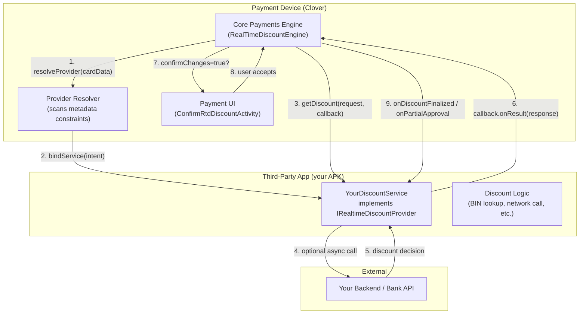
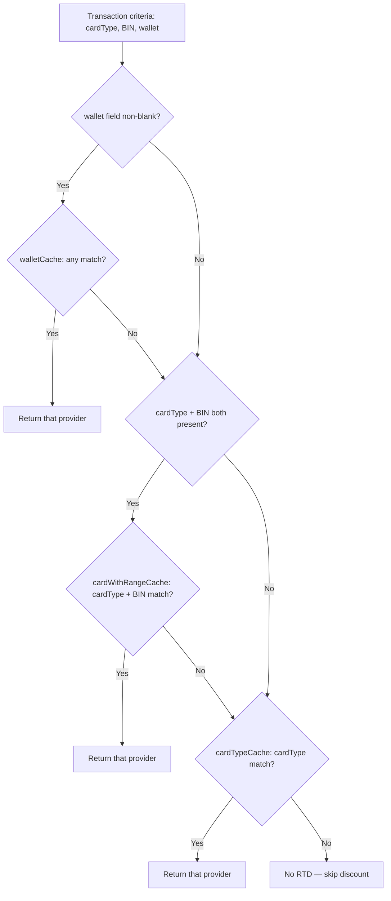
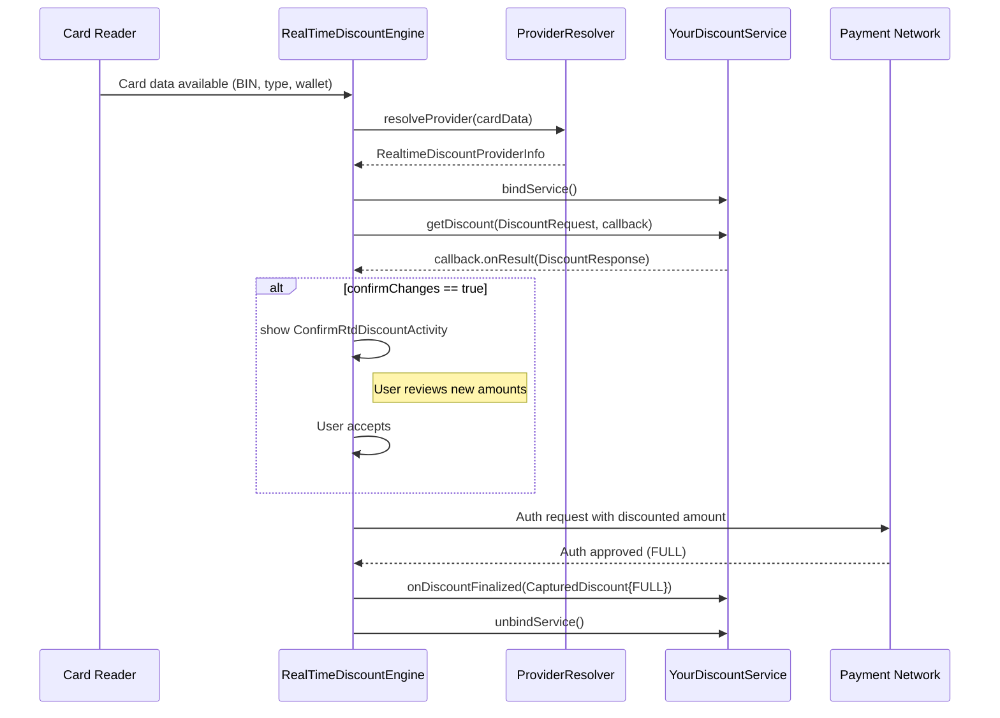
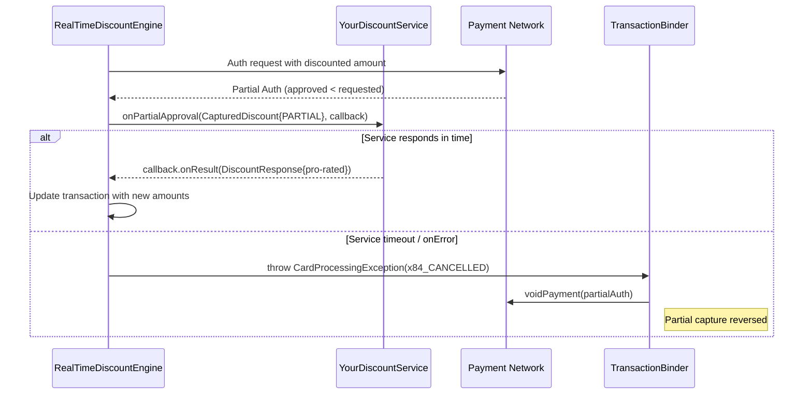
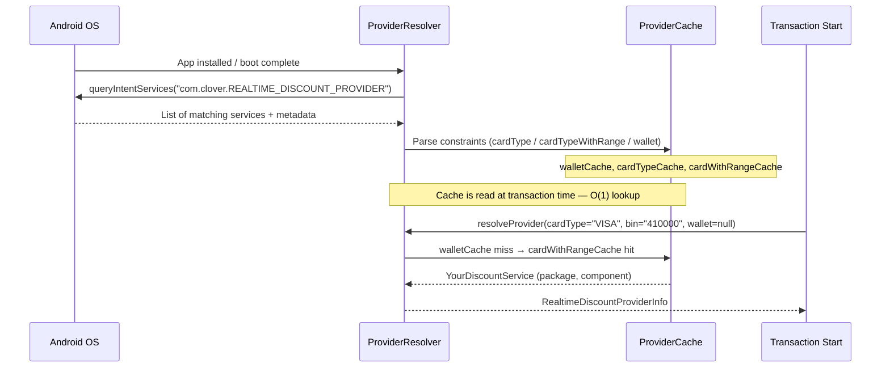

# Real-Time Discount (RTD) Provider — Developer Guide

A Real-Time Discount (RTD) is a financial discount calculated **during the live payment flow**, the instant card details are read. Unlike POS-level discounts that are applied before checkout, RTD computes its value against card BIN data, wallet type, and transaction amount — making it ideal for issuer-bank rebates, co-branded card promotions, and regional payment programmes (e.g., installment plan pricing in Argentina).

This guide covers everything needed to build, configure, and operate a well-behaved RTD Provider Service.

---

## Table of Contents

1. [System Architecture](#system-architecture)
2. [Why RTD Exists](#why-rtd-exists)
3. [Required Clover Permission](#required-clover-permission)
4. [Service Contract — AIDL Interface](#service-contract--aidl-interface)
5. [The Three Lifecycle Calls](#the-three-lifecycle-calls)
6. [Registering Your Service (AndroidManifest)](#registering-your-service-androidmanifest)
7. [Metadata Constraints — cardType, cardTypeWithRange, wallet](#metadata-constraints)
8. [Provider Resolution — How Clover Picks a Provider](#provider-resolution)
9. [Implementing a Well-Behaved Service](#implementing-a-well-behaved-service)
10. [Timeouts & Implicit-Void Safety Contract](#timeouts--implicit-void-safety-contract)
11. [Data Reference](#data-reference)
12. [Error Codes](#error-codes)
13. [Additional Data Keys (RtdConstants)](#additional-data-keys-rtdconstants)
14. [Complete Example](#complete-example)
15. [Sequence Diagrams](#sequence-diagrams)

---

## System Architecture



---

## Why RTD Exists

Traditional POS discounts are applied by the cashier before a card is presented. RTD solves a different problem: some promotions are **card-specific** and can only be evaluated after the magnetic stripe, chip, or NFC tap reveals the customer's card BIN. Examples:

- Issuer-funded rebates: the acquiring bank needs the first 6–8 digits (BIN) to identify the card's issuing institution.
- Regional installment plans (e.g., Argentina's *cuotas*): the number of interest-free instalments depends on the card issuer's agreement.
- Wallet-specific promotions: a retailer may offer 5% back specifically on Google Pay transactions.

Because these decisions happen **after the card is read but before the authorisation request is sent to the network**, the discount must be calculated instantly and in-process — hence "Real-Time".

---

## Required Clover Permission

Your APK **must** hold the Clover `PAYMENTS_R` permission for the platform to bind to your service.

> [!IMPORTANT]
> This permission is granted by Clover through the developer portal or device-level app configuration. Your APK will not be bound — even if correctly declared — until this permission is explicitly granted.

---

## Service Contract — AIDL Interface

Your service must implement `IRealtimeDiscountProvider` (AIDL) and return the binder from `onBind()`.

```kotlin
class YourDiscountService : Service() {

    private val binder = object : IRealtimeDiscountProvider.Stub() {
        override fun getDiscount(request: DiscountRequest, callback: IDiscountCallback) { ... }
        override fun onDiscountFinalized(capturedDiscount: CapturedDiscount) { ... }
        override fun onPartialApproval(capturedDiscount: CapturedDiscount, callback: IDiscountCallback) { ... }
    }

    override fun onBind(intent: Intent): IBinder = binder
}
```

All three methods run on the **Binder thread pool** — you may spawn async work (e.g., a network call) from within them, but you MUST eventually call `callback.onResult()` or `callback.onError()` within the timeout window.

---

## The Three Lifecycle Calls

### 1. `getDiscount(request, callback)` — Compute the discount

Called once card data is available, before the auth request is sent to the payment network. This is the primary decision point.

**Input — `DiscountRequest`:**

| Field | Type | Description |
|---|---|---|
| `amount` | `Long` | Transaction amount in smallest currency unit (e.g., cents) |
| `tipAmount` | `Long?` | Tip amount, if already selected |
| `taxAmount` | `Long?` | Tax amount |
| `orderId` | `String?` | Clover order UUID |
| `cardDetails` | `CardData?` | Card information: `first6`, `last4`, `cardType`, entry mode etc. |
| `isPOSRemote` | `Boolean` | `true` if the payment originates from a remote/cloud POS |
| `additionalData` | `Map<String,String>?` | Region-specific extras (see [RtdConstants](#additional-data-keys-rtdconstants)) |

You must call exactly one of:

```kotlin
callback.onResult(DiscountResponse(...))   // success — even if discountedAmount == original amount
callback.onError(errorCode, errorMessage)  // unrecoverable failure
```

> [!WARNING]
> **`discountedAmount` is the new post-discount TOTAL, not a deduction.**
> Return `request.amount` unchanged if no discount applies.
> Returning `0` would set the auth amount to zero — causing a $0 authorisation.

---

### 2. `onDiscountFinalized(capturedDiscount)` — Reconciliation / cleanup

Called when the payment completes fully (fully approved). **No callback is expected.** Use this for:
- Recording the applied discount in your backend
- Releasing any held resources
- Analytics / reconciliation logging

**Input — `CapturedDiscount`:**

| Field | Type | Description |
|---|---|---|
| `capturedAmount` | `Long` | Amount actually captured by the network |
| `taxAmount` | `Long?` | Final tax |
| `tipAmount` | `Long?` | Final tip |
| `cardDetails` | `CardData` | Full card data |
| `orderId` | `String` | Clover order UUID |
| `status` | `CaptureStatus` | `FULL`, `PARTIAL`, or `DECLINED` |
| `isPOSRemote` | `Boolean` | Remote POS flag |
| `additionalData` | `Map<String,String>?` | Provider-specific extras |

> [!NOTE]
> `onDiscountFinalized` is **fire-and-forget** from the engine's perspective. Do not perform long-running synchronous operations here, but it is not required to complete within any specific timeout.

---

### 3. `onPartialApproval(capturedDiscount, callback)` — Recalculate after partial auth

Some transactions are partially approved (e.g., the cardholder's available credit was $80 but the sale was $120). In this case the issuer returns an approval for a lesser amount and the engine needs to know what discount — if any — still applies.

Your response options:

- **Keep the discount**: return a `DiscountResponse` with `discountedAmount` = pro-rated new total for the `capturedAmount`.
- **Remove the discount**: return `discountedAmount = capturedDiscount.capturedAmount` (echo — no discount, but don't set to 0).
- **Reject the partial**: call `callback.onError(...)`. This causes the engine to void the partial payment (implicit void).

> [!WARNING]
> If you do not call `callback.onResult()` or `callback.onError()` within the timeout, the engine throws `CardProcessingException(x84_CANCELLED)` which is caught by the transaction binder and automatically **voids** the partially-approved payment. Always respond — even if the answer is "no discount on partial".

---

## Registering Your Service (AndroidManifest)

```xml
<service
    android:name=".YourDiscountService"
    android:exported="true">

    <!-- Required: exactly this action name -->
    <intent-filter>
        <action android:name="com.clover.REALTIME_DISCOUNT_PROVIDER" />
        <category android:name="android.intent.category.DEFAULT" />
    </intent-filter>

    <!-- At least one constraint meta-data is required -->
    <meta-data android:name="cardType"
        android:value='[{"cardType":"VISA"}]' />

    <meta-data android:name="cardTypeWithRange"
        android:value='[{"cardType":"VISA","lowBin":"400000","highBin":"499999"}]' />

    <meta-data android:name="wallet"
        android:value='[{"wallet":"GOOGLE_PAY"}]' />

</service>
```

> [!IMPORTANT]
> The service action `com.clover.REALTIME_DISCOUNT_PROVIDER` is mandatory and **case-sensitive**. Without it the Clover engine will not discover your service during provider scanning.

---

## Metadata Constraints

Constraints tell the Clover engine **which transactions your service cares about**. Your service is only bound and queried when a transaction matches at least one declared constraint. Not declaring constraints means your service is never called.

### `cardType` — Match by card brand

**Format:** JSON array of objects with a `cardType` string.

```xml
<meta-data android:name="cardType"
    android:value='[{"cardType":"VISA"},{"cardType":"MC"}]' />
```

**Known `cardType` values:**

| Value | Description |
|---|---|
| `VISA` | Visa |
| `MC` | Mastercard |
| `AMEX` | American Express |
| `DISCOVER` | Discover |
| `DINERS_CLUB` | Diners Club |
| `JCB` | JCB |
| `MAESTRO` | Maestro |
| `INTERAC` | Interac (Canada) |
| `CHINA_UNION_PAY` | UnionPay |
| `GIFT_CARD` | Clover Gift Card |
| `EBT` | Electronic Benefit Transfer |
| `GIROCARD` | Girocard (Germany) |
| `RUPAY` | RuPay (India) |
| `EFTPOS` | EFTPOS (Australia) |
| `BANCNET` | Bancnet (Philippines) |
| `OTHER` | Any other card |
| `UNKNOWN` | Unidentified card |

---

### `cardTypeWithRange` — Match by brand + BIN range

Use this when your discount only applies to cards from a **specific issuer** identified by BIN (first 6 digits). More specific than `cardType` and higher priority.

**Format:** JSON array of objects with `cardType`, `lowBin`, and `highBin`.

```xml
<meta-data android:name="cardTypeWithRange"
    android:value='[
        {"cardType":"VISA","lowBin":"400000","highBin":"409999"},
        {"cardType":"MC","lowBin":"510000","highBin":"519999"}
    ]' />
```

- `lowBin` and `highBin` are **inclusive** numeric strings of the card's first 6 digits.
- The match check is: `lowBin <= card.first6 <= highBin`

---

### `wallet` — Match by digital wallet

Use this when your discount applies to contactless wallet payments regardless of the underlying card.

**Format:** JSON array of objects with a `wallet` string.

```xml
<meta-data android:name="wallet"
    android:value='[{"wallet":"GOOGLE_PAY"},{"wallet":"APPLE_PAY"}]' />
```

**Known `wallet` values:** `GOOGLE_PAY`, `APPLE_PAY`, `SAMSUNG_PAY`, `DEFAULT`

---

### Multiple constraints in a single service

A single service can declare all three constraint types. The engine evaluates them in **precedence order**:

```
wallet  >  cardTypeWithRange  >  cardType
```

If a transaction matches your `wallet` constraint, that takes priority over `cardTypeWithRange` and `cardType`. Within the same precedence level, the **first match** in the JSON array wins.

---

## Provider Resolution

The actual resolution order is determined by `DefaultRealtimeDiscountProviderResolver.resolveProvider()`. It checks three caches in strict order:

```
1. wallet          (walletCache)
2. cardTypeWithRange  (cardWithRangeCache)  ← only if cardType + BIN both present
3. cardType        (cardTypeCache)
```

> [!IMPORTANT]
> **The order is `wallet` → `cardTypeWithRange` → `cardType`.**
> `cardTypeWithRange` (BIN-range match) is evaluated **before** the generic `cardType` match.
> If wallet is present in the transaction but no provider matches it, the resolver **falls through** to check `cardTypeWithRange` and `cardType` — it does not stop.



**Key rules:**
- **Priority order**: `wallet` > `cardTypeWithRange` > `cardType` (code-verified)
- **Wallet miss falls through**: if a wallet is present (e.g. GOOGLE_PAY) but no service declared that wallet constraint, the engine continues and checks `cardTypeWithRange` / `cardType` for the underlying card.
- **Multiple matches at same level**: selection is **non-deterministic** (first-in-list wins, list order determined by `queryIntentServices` scan order). Design your constraints to be non-overlapping.
- The resolver caches provider metadata at startup. Changes take effect after the cache is refreshed (device reboot or relevant system event).

---

## Implementing a Well-Behaved Service

### Async network calls

The AIDL binder thread must not be blocked long-term. Spawn a coroutine or thread for network calls:

```kotlin
override fun getDiscount(request: DiscountRequest, callback: IDiscountCallback) {
    CoroutineScope(Dispatchers.IO).launch {
        try {
            val discount = myBackend.queryDiscount(
                bin = request.cardDetails?.first6,
                amount = request.amount
            )
            callback.onResult(DiscountResponse(
                discountedAmount = discount.amountCents,
                discountType = discount.promoCode,
                success = true
            ))
        } catch (e: Exception) {
            callback.onError(DiscountErrorCode.NETWORK_FAILURE, e.message ?: "Unknown error")
        }
    }
}
```

### Always respond — even when there is no discount

If your promotion doesn't apply to a specific transaction, echo back the original amount — **do not return `discountedAmount = 0`**:

```kotlin
callback.onResult(DiscountResponse(
    discountedAmount = request.amount,   // echo original — no change to auth amount
    discountType = "NONE",
    success = true
))
```

### Handle `onBind` / `onUnbind` correctly

The Clover engine binds once per transaction (or keeps the binding alive across nearby transactions). Your service should be stateless or handle the binder lifecycle gracefully. Avoid holding heavyweight resources in the service's `onCreate`/`onBind`.

### Thread safety

`getDiscount` and `onPartialApproval` may be called from different binder threads. Any shared mutable state (e.g., caches, in-flight-request maps) must be thread-safe.

---

## Timeouts & Implicit-Void Safety Contract

| Call | Timeout               | On Timeout |
|---|-----------------------|---|
| `getDiscount` | **<= 0.5 seconds**    | Transaction is cancelled and user is prompted to retry |
| `onPartialApproval` | **<= 0.5 seconds**    | `CardProcessingException(x84_CANCELLED)` is thrown, which causes the partial payment to be **automatically voided** |
| `onDiscountFinalized` | N/A (fire-and-forget) | No consequence |

> [!WARNING]
> A missed `onPartialApproval` callback is the most dangerous case. The payment processor has already authorised funds, and a void is initiated to reverse the partial capture. **Always call `callback.onResult()` or `callback.onError()` from `onPartialApproval`.**

**Defensive coding pattern — enforce your own internal timeout:**

```kotlin
override fun onPartialApproval(capturedDiscount: CapturedDiscount, callback: IDiscountCallback) {
    val job = CoroutineScope(Dispatchers.IO).launch {
        try {
            withTimeout(250) {  // 1/2 the engine's deadline
                val response = recomputeDiscount(capturedDiscount)
                callback.onResult(response)
            }
        } catch (e: TimeoutCancellationException) {
            // Echo captured amount — safe no-op, does NOT set auth to $0
            callback.onResult(DiscountResponse(
                discountedAmount = capturedDiscount.capturedAmount,
                discountType = "TIMEOUT_FALLBACK",
                success = true
            ))
        } catch (e: Exception) {
            callback.onError(DiscountErrorCode.INTERNAL_ERROR, e.message ?: "")
        }
    }
}
```

---

## Data Reference

### `DiscountRequest`

```kotlin
data class DiscountRequest(
    val amount: Long,                     // total amount in minor currency units
    val tipAmount: Long? = null,
    val taxAmount: Long? = null,
    val orderId: String? = null,
    val cardDetails: CardData? = null,    // contains first6, last4, cardType, entryMode
    val isPOSRemote: Boolean = false,
    val additionalData: Map<String, String>? = null
)
```

### `DiscountResponse`

```kotlin
data class DiscountResponse(
    val discountedAmount: Long,             // NEW post-discount total (replaces auth amount)
    val tipAmount: Long? = null,          // return updated tip if modified
    val taxAmount: Long? = null,          // return updated tax if modified
    val orderId: String? = null,
    val discountType: String,             // label for receipts / logging
    val success: Boolean,
    val errorMessage: String? = null,
    val additionalData: Map<String, String>? = null
)
```

> [!WARNING]
> **`discountedAmount` is the new TOTAL amount, not a deduction delta.**
> The engine does `authRequest.amount = discountResponse.discountedAmount`, replacing the original amount entirely.
> - $100 sale with $10 off → return `discountedAmount = 9000` (i.e. $90.00 in cents).
> - No discount applies → return `discountedAmount = request.amount` (echo the original).
> - **Never return `discountedAmount = 0`** for "no discount" — this would cause a $0 authorisation attempt.

### `CapturedDiscount`

```kotlin
data class CapturedDiscount(
    val capturedAmount: Long,             // amount authorised by the network
    val taxAmount: Long?,
    val tipAmount: Long?,
    val cardDetails: CardData,
    val orderId: String,
    val status: CaptureStatus,            // FULL | PARTIAL | DECLINED
    val isPOSRemote: Boolean = false,
    val additionalData: Map<String, String>? = null
)
```

---

## Error Codes

Use these standard codes with `callback.onError()`:

| Code | Constant | When to use |
|---|---|---|
| 1000 | `UNKNOWN_ERROR` | Truly unexpected failure |
| 1001 | `INTERNAL_ERROR` | Bug in your service logic |
| 1002 | `NETWORK_FAILURE` | Backend unreachable |
| 1003 | `TIMEOUT` | Your own internal deadline exceeded |
| 1004 | `INVALID_REQUEST` | Request data is malformed/unsupported |

---

## Additional Data Keys (RtdConstants)

For region-specific flows (e.g., Argentina installment plans), the following keys are used in the `additionalData` maps:

| Direction | Key | Description |
|---|---|---|
| Request | `merchantId` | Merchant identifier for the acquiring bank |
| Request | `installments` | Number of installments selected by the POS |
| Request | `entryMode` | Card entry method (`SWIPED`, `DIPPED`, `TAPPED`) |
| Response | `newMerchantId` | Updated merchant ID to use for this transaction |
| Response | `newInstallments` | Provider-adjusted installment count |
| Response | `confirmChanges` | `"true"` to trigger the confirmation UI before finalising |

> [!NOTE]
> When `confirmChanges=true` is returned in `additionalData`, the Clover UI will display a confirmation screen (`ConfirmRtdDiscountActivity`) showing the revised amounts before the user accepts or declines.

---

## Complete Example

### Service implementation (Kotlin)

```kotlin
class YourDiscountService : Service() {

    private val binder = object : IRealtimeDiscountProvider.Stub() {

        override fun getDiscount(request: DiscountRequest, callback: IDiscountCallback) {
            CoroutineScope(Dispatchers.IO).launch {
                try {
                    withTimeout(250) {
                        val first6 = request.cardDetails?.first6 ?: ""
                        val discountCents = MyBankApi.lookupDiscount(first6, request.amount)

                        callback.onResult(DiscountResponse(
                            discountedAmount = discountCents,
                            discountType = if (discountCents > 0) "BANK_PROMO" else "NONE",
                            orderId = request.orderId,
                            success = true
                        ))
                    }
                } catch (_: TimeoutCancellationException) {
                    callback.onResult(DiscountResponse(discountedAmount = 0L, discountType = "TIMEOUT", success = true))
                } catch (e: Exception) {
                    callback.onError(DiscountErrorCode.NETWORK_FAILURE, e.message ?: "")
                }
            }
        }

        override fun onDiscountFinalized(capturedDiscount: CapturedDiscount) {
            // Fire-and-forget: log the final captured amount for reconciliation
            MyBankApi.recordCapture(capturedDiscount.orderId, capturedDiscount.capturedAmount)
        }

        override fun onPartialApproval(capturedDiscount: CapturedDiscount, callback: IDiscountCallback) {
            CoroutineScope(Dispatchers.IO).launch {
                try {
                    withTimeout(250) {
                        // discountedAmount = NEW total for the partial amount
                        // e.g. if capturedAmount=$80 and 10% applies: return 7200 ($72.00)
                        val discount = if (capturedDiscount.capturedAmount > 10_000L)
                            (capturedDiscount.capturedAmount * 0.90).toLong()  // 10% off = 90% of total
                        else
                            capturedDiscount.capturedAmount  // no discount — echo captured amount

                        callback.onResult(DiscountResponse(
                            discountedAmount = discount,   // NEW total, not a deduction
                            discountType = if (discount < capturedDiscount.capturedAmount) "PARTIAL_PROMO" else "NONE",
                            orderId = capturedDiscount.orderId,
                            success = true
                        ))
                    }
                } catch (_: TimeoutCancellationException) {
                    // CRITICAL: echo captured amount — safe no-op, avoids implicit void
                    callback.onResult(DiscountResponse(
                        discountedAmount = capturedDiscount.capturedAmount,
                        discountType = "TIMEOUT",
                        success = true
                    ))
                } catch (e: Exception) {
                    callback.onError(DiscountErrorCode.INTERNAL_ERROR, e.message ?: "")
                }
            }
        }
    }

    override fun onBind(intent: Intent): IBinder = binder
}
```

### Manifest

```xml
<service
    android:name=".YourDiscountService"
    android:exported="true">

    <intent-filter>
        <action android:name="com.clover.REALTIME_DISCOUNT_PROVIDER" />
        <category android:name="android.intent.category.DEFAULT" />
    </intent-filter>

    <!-- Applies to all Visa cards -->
    <meta-data android:name="cardType"
        android:value='[{"cardType":"VISA"}]' />

    <!-- Or target a specific BIN range (higher priority than cardType) -->
    <meta-data android:name="cardTypeWithRange"
        android:value='[{"cardType":"VISA","lowBin":"410000","highBin":"419999"}]' />

    <!-- Or target a wallet -->
    <meta-data android:name="wallet"
        android:value='[{"wallet":"GOOGLE_PAY"}]' />

</service>
```

---

## Sequence Diagrams

### Standard Happy Path



### Partial Approval & Implicit Void



### Provider Resolution Timing



---

## Developer Checklist

Before publishing your RTD provider:

- [ ] Service is `android:exported="true"`
- [ ] Intent filter action is exactly `com.clover.REALTIME_DISCOUNT_PROVIDER`
- [ ] At least one `<meta-data>` constraint tag declared
- [ ] Constraints use valid JSON array format
- [ ] `getDiscount` always calls `callback.onResult()` or `callback.onError()` within 0.5 seconds
- [ ] `onPartialApproval` always calls `callback.onResult()` or `callback.onError()` within 0.5 seconds
- [ ] `onDiscountFinalized` does not block or throw
- [ ] Service is stateless or thread-safe (multiple binder threads)
- [ ] **No-discount case returns `discountedAmount = request.amount` (original total), NOT `0`**
- [ ] **Timeout fallback returns `discountedAmount = capturedDiscount.capturedAmount`, NOT `0`**
- [ ] Tested with a real partial-approval scenario
